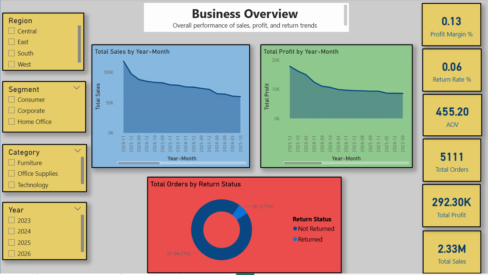
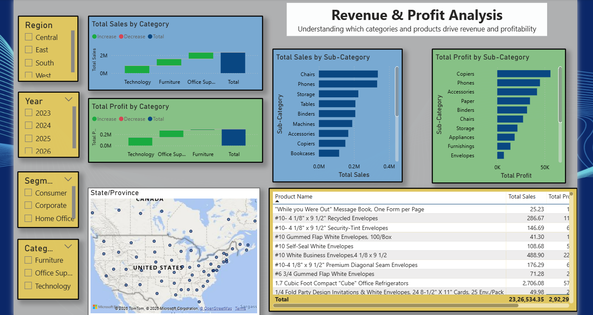
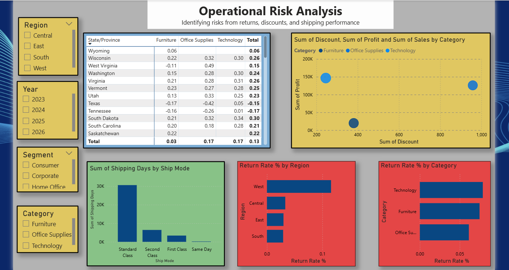
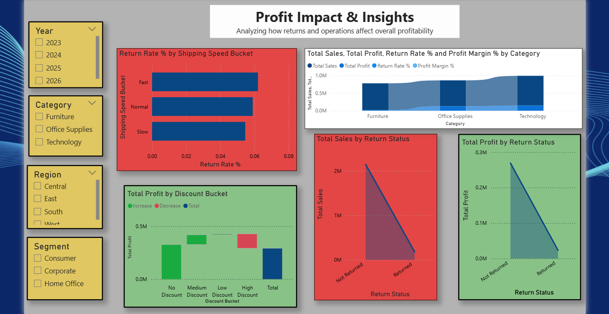

# 📊 E-commerce Profit Leakage Analysis Dashboard

## 📌 Project Overview

This project presents an interactive Power BI dashboard built using the Superstore dataset to analyze sales performance, profitability, and hidden business risks.

Unlike traditional dashboards that focus only on revenue, this project investigates **profit leakage** caused by returns, discounts, and operational inefficiencies.

-------------------------------------------------------------------------------------------------------------------------------------------------------------

## 🎯 Business Objective

To identify hidden factors affecting profitability and answer key business questions such as:

* Are high sales categories truly profitable?
* How do returns impact overall business performance?
* Does discounting reduce profit margins?
* Is shipping performance influencing return rates?

----------------------------------------------------------------------------------------------------------------------------------------------------------------

## 📂 Dataset

The dataset used in this project is the **Sample Superstore dataset**, which includes:

* Orders data (sales, profit, discount, shipping details)
* Returns data (returned orders)
* Customer, product, and regional information

📁 Files included in this repository:

* `Orders.xlsx`
* `Returns.xlsx`
* `People.xlsx`

-------------------------------------------------------------------------------------------------------------------------------------------------------------

## 📊 Dashboard Structure

### 🔹 1. Business Overview

* Total Sales, Profit, Orders, AOV, Return Rate
* Monthly Sales & Profit Trends
* Return distribution

📷 Screenshot:

-------------------------------------------------------------------------------------------------------------------------------------------------------------------

### 🔹 2. Revenue & Profit Analysis

* Sales and Profit by Category & Sub-Category
* Product-level analysis
* Regional sales distribution

📷 Screenshot:

----------------------------------------------------------------------------------------------------------------------------------------------------------------

### 🔹 3. Operational Risk Analysis

* Return Rate by Region & Category
* Shipping performance analysis
* Discount vs Profit relationship

📷 Screenshot:

----------------------------------------------------------------------------------------------------------------------------------------------------------------

### 🔹 4. Profit Impact & Insights

* Returned vs Non-returned performance
* Profit by Discount Bucket
* Impact of shipping speed on returns

📷 Screenshot:

----------------------------------------------------------------------------------------------------------------------------------------------------------------

## 🛠️ Tools & Technologies

* Power BI
* DAX (Data Analysis Expressions)
* Microsoft Excel

----------------------------------------------------------------------------------------------------------------------------------------------------------------

## 📈 Key Insights

* High sales do not always result in high profitability.
* Products with higher discounts tend to have lower profit margins.
* Returned orders contribute significantly to profit loss.
* Slower shipping is associated with higher return rates.

----------------------------------------------------------------------------------------------------------------------------------------------------------------

## 🚀 Conclusion

This dashboard highlights how operational factors like returns, discounting, and shipping efficiency can impact business performance.

It demonstrates the importance of combining **business metrics with operational analysis** to make better data-driven decisions.

----------------------------------------------------------------------------------------------------------------------------------------------------------------

## 👩‍💻 Author

**Medha Desawale**
Final Year B.Tech (CSE) | Aspiring Data Analyst

----------------------------------------------------------------------------------------------------------------------------------------------------------------

## ⭐ If you like this project

Give it a ⭐ on GitHub and feel free to share your feedback!
